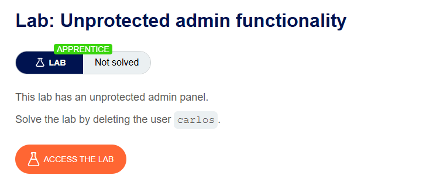
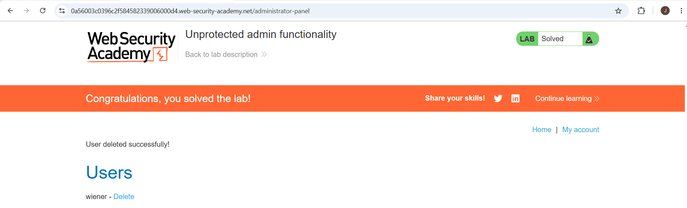

# Access Control

## What is Access Control?

Access Control is a security mechanism that decides:

* Who can access a resource
* What actions they can perform

### Simple Example

Imagine a college:

* Students can enter classrooms.
* Faculty can enter classrooms and staff rooms.
* Principal can enter every room.

Not everyone can go everywhere.

This restriction is called **Access Control**.

In websites, access control decides:

* Which pages a user can open
* Which data a user can view
* Which actions a user can perform

---

# How Access Control Works

Access Control depends on three things:

## 1. Authentication

Authentication verifies a user's identity.

### Question

"Who are you?"

### Example

You enter:

* Username: Sai
* Password: 12345

The website checks whether these credentials are correct.

If correct, you are authenticated.

---

## 2. Session Management

After login, the website must remember who you are.

### Question

"How does the website remember me?"

### Example

After login, the server gives you a session cookie.

Every request you send contains this cookie.

The server uses it to identify you.

Without session management, you would need to log in again for every page.

---

## 3. Access Control

After identifying you, the website decides what you are allowed to do.

### Question

"What can you access?"

### Example

Admin:

* Create users
* Delete users
* Change settings

Normal User:

* View profile
* Edit own profile

The website checks permissions before allowing the action.

---

# Why is Access Control Important?

Without proper access control:

* Users can access sensitive data
* Users can access admin pages
* Attackers can perform unauthorized actions

This leads to a vulnerability called **Broken Access Control**.

---

# Access Control Security Models

These are different methods used to manage permissions.

---

## 1. Programmatic Access Control

Permissions are stored in a database.

The application checks the database before granting access.

### Example

Database:

| User | Role  |
| ---- | ----- |
| Sai  | User  |
| John | Admin |

When Sai tries to open the admin panel:

1. Application checks database
2. Finds role = User
3. Access denied

When John tries:

1. Application checks database
2. Finds role = Admin
3. Access allowed

---

## 2. Discretionary Access Control (DAC)

The owner of a resource decides who can access it.

### Easy Example

Google Drive

You create a file.

Since you own it, you can:

* Share it
* Remove access
* Give edit permission

You control the permissions.

This is DAC.

---

## 3. Mandatory Access Control (MAC)

Permissions are controlled by a central authority.

Users cannot change permissions.

### Easy Example

Military Documents

Document Classification:

* Public
* Confidential
* Secret
* Top Secret

A soldier cannot decide who can view a Top Secret document.

Only the central authority decides.

This is MAC.

---

## 4. Role-Based Access Control (RBAC)

Permissions are assigned to roles instead of individual users.

### Easy Example

Company Employees

Roles:

| Role     | Permissions  |
| -------- | ------------ |
| Admin    | Full Access  |
| Manager  | Manage Team  |
| Employee | Basic Access |

Instead of giving permissions one by one:

* Create roles
* Assign permissions to roles
* Assign users to roles

This is easier to manage.

---

# Types of Access Control

---

## 1. Vertical Access Control

Controls access based on privilege level.

### Think of a Ladder

Admin
↑

Manager
↑

User

Higher levels have more permissions.

### Example

Admin can:

* Delete users
* Create users
* Change settings

User cannot.

If a user reaches admin functions, access control has failed.

---

## 2. Horizontal Access Control

Controls access between users at the same level.

### Example

Two Bank Customers

User A:

* Can view Account A

User B:

* Can view Account B

User A should never access Account B.

This restriction is Horizontal Access Control.

---

## 3. Context-Dependent Access Control

Access depends on the current state of the application.

### Example

Online Shopping

Step 1:
Add items to cart

Step 2:
Checkout

Step 3:
Pay

After payment, users should not modify the order.

The action depends on the current state.

This is Context-Dependent Access Control.

---

# Broken Access Control

Broken Access Control happens when users can do things they should not be allowed to do.

---

## Vertical Privilege Escalation

A low-privileged user gains higher privileges.

### Example

Normal User:

* View profile
* Edit profile

Admin:

* Delete users
* Change settings

If a normal user somehow accesses admin functions, it is called:

**Vertical Privilege Escalation**

---

## Unprotected Functionality

A sensitive page exists but no permission check is performed.

### Example

Admin page:

```text
https://website.com/admin
```

Developer hides the link from users.

But if anyone directly visits:

```text
https://website.com/admin
```

and gains access,

the admin page is unprotected.

---

## robots.txt Information Disclosure

Developers sometimes accidentally reveal sensitive pages.

Example:

```text
https://website.com/robots.txt
```

Contents:

```text
User-agent: *
Disallow: /admin
```

An attacker reads robots.txt and discovers the admin panel.

---

## URL Guessing

Attackers often guess common admin URLs.

Examples:

```text
/admin
/administrator
/admin-panel
/dashboard
/control-panel
```

If access control is weak, attackers may gain access.

---



# Information Disclosure in robots.txt

## Step 1: Access robots.txt

1. Open the lab.
2. Append:

```text
/robots.txt
```

to the lab URL.

Example:

```text
https://LAB-ID.web-security-academy.net/robots.txt
```


## Step 2: Examine robots.txt

Observe the response:

```text
User-agent: *
Disallow: /administrator-panel
```

Notice:

```text
The admin panel path is disclosed.
```

## Step 3: Access the Admin Panel

Replace:

```text
/robots.txt
```

with:

```text
/administrator-panel
```

Example:

```text
https://LAB-ID.web-security-academy.net/administrator-panel
```

## Step 4: Open Administrator Panel

The administrator interface loads successfully.

Example:

```text
Admin Panel
 ├─ Users
 ├─ Delete User
 └─ Admin Functions
```

## Step 5: Delete Carlos

1. Locate user:

```text
carlos
```

2. Click:

```text
Delete
```

or use the delete link associated with Carlos.

## Step 6: Lab Solved

After deleting:

```text
carlos
```

the lab is solved.


# Vulnerability Explanation

The file:

```text
robots.txt
```

is intended to tell search engines which pages should not be indexed.

Example:

```text
Disallow: /administrator-panel
```

However, it is publicly accessible.

As a result:

```text
Sensitive paths are disclosed to attackers.
```


---
